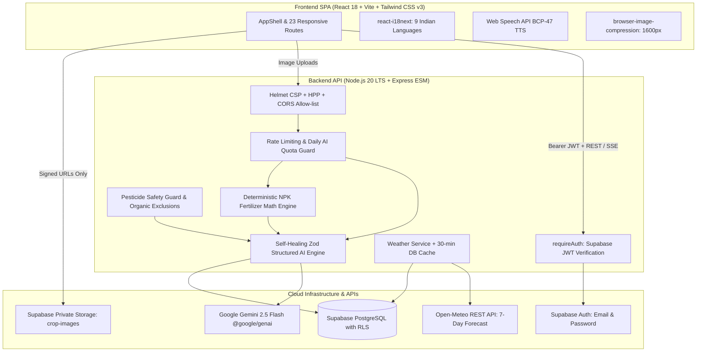

# CropSage AI — Production Agriculture Crop Advisory Assistant

> **AI-Powered Agriculture Crop Advisory Assistant**: Personalized, weather-aware, safety-first agronomic advisory system for smallholder farmers across India in 9 native languages.

---

## 1. System Architecture



---

## 2. Key Capabilities & Agricultural Safeguards

1. **Weather-Grounded Stage Advisories**: Calibrated using live 7-day Open-Meteo precipitation, humidity, and temperature forecasts. Irrigation tasks automatically advise skipping or adjusting based on impending rainfall.
2. **Deterministic Soil Health Card (SHC) Mathematics**: Fertilizer doses for N, P, and K are computed deterministically on the server (Low soil rating: +25%, Medium: baseline, High: -25%) before invoking Gemini. The AI only schedules application splits and cannot modify computed quantities.
3. **Multimodal IPM Treatment Ladder**: Diagnoses leaf/stem images adhering strictly to Integrated Pest Management:
   - Tier 1: Cultural & Mechanical Methods
   - Tier 2: Biological & Neem/Organic Solutions
   - Tier 3: Regulated Chemical Sprays (strictly collapsed by default with mandatory PPE, active ingredients only, and Pre-Harvest Intervals).
4. **Banned Chemical Interception**: Scans active ingredients against pesticides banned in India (e.g. monocrotophos, endosulfan, DDT, methyl parathion) and retries/strips non-compliant outputs.
5. **Multi-Language Support**: Complete UI translations for English (`en`) and Hindi (`hi`), and native script generation for 9 Indian languages (`en`, `hi`, `kn`, `mr`, `ta`, `te`, `bn`, `gu`, `pa`) with Web Speech API audio playback.
6. **Zero Client Secrets**: The Google Gemini API key and Supabase Service Role key are confined to the server. Enforced via automated build checks (`scripts/check-client-secrets.mjs`).

---

## 3. Database Schema & Migration Instructions

The complete cloud database schema—including PostgreSQL enums, tables, RLS policies, private storage bucket configuration, and the 42-crop seed catalog—is provided in a single, idempotent SQL script:

```
supabase/migrations/001_initial_schema.sql
```

### Option A: Apply Directly via Supabase Dashboard (Recommended)
1. Open your Supabase project dashboard: [https://supabase.com/dashboard](https://supabase.com/dashboard).
2. Navigate to the **SQL Editor**.
3. Copy and paste the contents of `supabase/migrations/001_initial_schema.sql`.
4. Click **Run**. This provisions all 11 public tables, enables Row Level Security (RLS) on each, creates the private `crop-images` storage bucket with access policies, and seeds all 42 benchmark crops.

### Option B: Automated Migration via Service Role Key
Configure your `server/.env` with your `SUPABASE_URL` and `SUPABASE_SERVICE_ROLE_KEY`, then run:
```bash
npm run db:migrate
```

---

## 4. Local Development Setup

### Prerequisites
- Node.js 20 LTS or higher
- npm 10 or higher
- A Supabase project (URL + Anon Key + Service Role Key)
- A Google Gemini API Key

### Step 1: Clone and Install
```bash
git clone <repository-url> cropsage-ai
cd cropsage-ai
npm install
```

### Step 2: Configure Environment Variables

**Create `server/.env`**:
```dotenv
NODE_ENV=development
PORT=8080
CORS_ORIGINS=http://localhost:5173
LOG_LEVEL=info
APP_VERSION=1.0.0

# Supabase Cloud Configuration
SUPABASE_URL=https://your-project-id.supabase.co
SUPABASE_ANON_KEY=your-anon-key
SUPABASE_SERVICE_ROLE_KEY=your-service-role-key
SUPABASE_STORAGE_BUCKET=crop-images

# Google Gemini Configuration (Server Only)
GEMINI_API_KEY=your-gemini-api-key
GEMINI_MODEL_TEXT=gemini-2.5-flash
GEMINI_MODEL_VISION=gemini-2.5-flash
GEMINI_MODEL_CHAT=gemini-2.5-flash

# Weather & Caching
OPEN_METEO_BASE_URL=https://api.open-meteo.com/v1/forecast
WEATHER_CACHE_TTL_MINUTES=30

# User Limits & Quotas
AI_HOURLY_LIMIT_PER_USER=20
AI_DAILY_QUOTA_PER_USER=60
UPLOAD_DAILY_LIMIT_PER_USER=30
```

**Create `client/.env`**:
```dotenv
VITE_API_BASE_URL=http://localhost:8080/api/v1
VITE_SUPABASE_URL=https://your-project-id.supabase.co
VITE_SUPABASE_ANON_KEY=your-anon-key
VITE_APP_NAME=CropSage AI
```

### Step 3: Run Development Server
```bash
npm run dev
```
- Client runs at: `http://localhost:5173`
- Backend API runs at: `http://localhost:8080/api/v1`

---

## 5. Verification & Testing

Execute the complete quality and security verification suite:

```bash
# 1. Typecheck all workspaces with strict TypeScript
npm run typecheck

# 2. Run unit and integration tests (27/27 green)
npm test

# 3. Audit for secrets leakage in client bundle
npm run lint

# 4. Compile production bundles
npm run build
```

---

## 6. Deployment Guide (Render + Vercel)

### Backend API on Render (Render Web Service / Blueprint)
The backend runs as a Node.js Web Service on [Render](https://render.com). A ready-to-use Blueprint is defined in `render.yaml`.

#### Option A: 1-Click Render Blueprint
1. Push your repository to GitHub.
2. In the Render Dashboard, click **New +** -> **Blueprint**.
3. Connect your repository. Render will automatically read `render.yaml`.
4. Fill in the sensitive environment variables (`GEMINI_API_KEY`, `SUPABASE_SERVICE_ROLE_KEY`, `SUPABASE_ANON_KEY`, `SUPABASE_URL`).
5. Click **Apply**.

#### Option B: Manual Web Service on Render
- **Environment**: `Node`
- **Root Directory**: `.` (leave as root)
- **Build Command**: `npm install && npm run build:server`
- **Start Command**: `npm run start:server`
- **Health Check Path**: `/api/v1/health`
- **Environment Variables**:
  - `NODE_ENV`: `production`
  - `PORT`: `8080` (or leave default assigned by Render)
  - `CORS_ORIGINS`: `https://your-frontend.vercel.app,https://*.vercel.app`
  - `SUPABASE_URL`: `https://lvtizqodwqjkygmmdeyz.supabase.co`
  - `SUPABASE_ANON_KEY`: `<your-anon-key>`
  - `SUPABASE_SERVICE_ROLE_KEY`: `<your-service-role-key>`
  - `SUPABASE_STORAGE_BUCKET`: `crop-images`
  - `GEMINI_API_KEY`: `<your-gemini-api-key>`
  - `GEMINI_MODEL_TEXT`: `gemini-2.5-flash`
  - `GEMINI_MODEL_VISION`: `gemini-2.5-flash`
  - `GEMINI_MODEL_CHAT`: `gemini-2.5-flash`
  - `OPEN_METEO_BASE_URL`: `https://api.open-meteo.com/v1/forecast`
  - `WEATHER_CACHE_TTL_MINUTES`: `30`
  - `AI_HOURLY_LIMIT_PER_USER`: `20`
  - `AI_DAILY_QUOTA_PER_USER`: `60`
  - `UPLOAD_DAILY_LIMIT_PER_USER`: `30`

---

### Frontend SPA on Vercel
The frontend is built with React + Vite and deployed to [Vercel](https://vercel.com) with automatic client-side routing via `vercel.json`.

1. In the Vercel Dashboard, click **Add New...** -> **Project**.
2. Import your GitHub repository.
3. Configure the Project Settings:
   - **Framework Preset**: `Vite`
   - **Root Directory**: `./` (or leave default root)
   - **Build Command**: `npm run build:client` (automatically pre-builds `@cropsage/shared` and compiles `@cropsage/client`)
   - **Output Directory**: `client/dist`
   - **Install Command**: `npm install`
4. Set Environment Variables:
   - `VITE_API_BASE_URL`: `https://cropsage-backend.onrender.com/api/v1` *(replace with your deployed Render URL)*
   - `VITE_SUPABASE_URL`: `https://lvtizqodwqjkygmmdeyz.supabase.co`
   - `VITE_SUPABASE_ANON_KEY`: `<your-anon-key>`
   - `VITE_APP_NAME`: `CropSage AI`
5. Click **Deploy**.
6. Once deployed, copy your Vercel domain (`https://cropsage-xxx.vercel.app`) and ensure it is included in your Render backend `CORS_ORIGINS` setting.

---

## 7. Prompt Versioning & Immutability

All AI prompts are centralized under `server/src/ai/prompts/` and tagged with `PROMPT_VERSION = 'v1.0.0'`. Every generated advisory, recommendation, and diagnosis row persists the active model identifier and prompt version string. This ensures historical reproducibility and auditability of all agronomic guidance.
